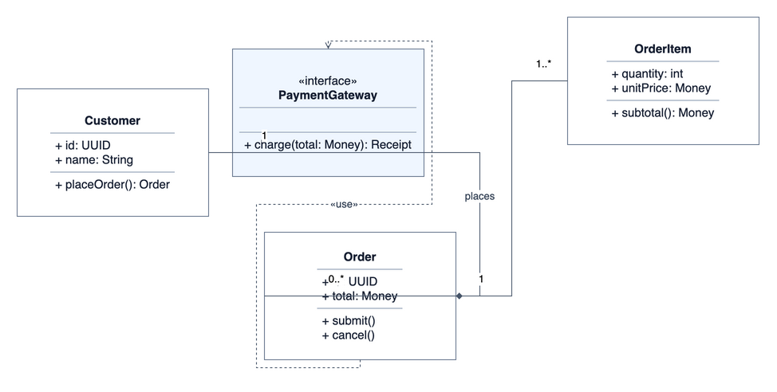
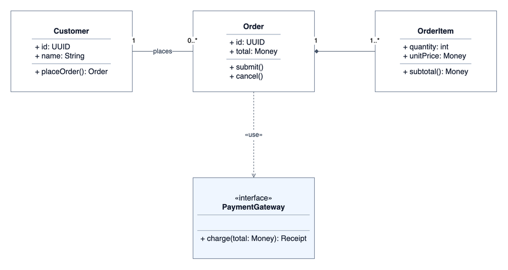

# Draw.io UML

**让 UML 图更清晰、更整洁，并始终保持可编辑。**

Draw.io UML 是面向 AI 编程助手的绘图技能，支持从需求设计 UML 图，也能整理已有 `.drawio` 文件的布局、连线和标签。它将图型设计指导、原生 XML 生成、几何检查和预览导出组合成完整工作流。

无需其他 skill 或 MCP 服务。Python 工具仅使用标准库，预览导出使用本地 draw.io Desktop。

## 效果预览

同一张类图，保留类、成员、关系类型和多重性，只调整布局与布线。

| 整理前 | 整理后 |
| --- | --- |
|  |  |

[整理前源文件](examples/class-before.drawio) · [整理后源文件](examples/class-after.drawio) · [时序图示例](examples/sequence.drawio)

## 功能

- **从需求绘图**：选择适当的 UML 视图，组织节点、分组、关系和阅读顺序。
- **整理已有图**：改善对齐、间距、连线和标签位置，保留原有内容与关系语义。
- **检查布局**：识别支持范围内的节点重叠、连线交叉、重合和穿框，明确报告无法解析的图形。
- **比较修改**：对比整理前后的标签、连接端点、关系样式、归属和元数据，提示可能改变语义的差异。
- **交付可编辑文件**：保留 `.drawio` 源文件，按需导出 SVG、PNG 或 PDF。

设计指导覆盖类图、时序图、活动图、状态图、用例图、组件图和部署图。类图与时序图已完成真实渲染验证；其他图型的端到端示例仍待补充。

## 环境要求

| 依赖 | 用途 |
| --- | --- |
| 支持 `SKILL.md` 的 AI 助手 | 读取设计指导并执行绘图工作流 |
| Python 3.10+ | XML 生成、几何检查、语义比较及导出脚本 |
| [draw.io Desktop](https://github.com/jgraph/drawio-desktop/releases) | 导出预览；仅生成或编辑 `.drawio` 时不需要 |

导出已在 macOS 与 draw.io Desktop 31.4.5 上验证。Windows 可通过 `--binary` 指定程序路径；Linux 需要图形会话或虚拟显示环境。这两个平台尚未实测。

## 安装

克隆仓库：

```bash
git clone https://github.com/LightMinato/drawio-uml-skill.git
cd drawio-uml-skill
```

将 `drawio-uml/` 文件夹复制到助手的技能目录。例如，首次安装到共享技能目录：

```bash
mkdir -p ~/.agents/skills
cp -R drawio-uml ~/.agents/skills/
```

也可放入项目的 `.agents/skills/`，按需限定使用范围。更新已有安装时，替换对应的 `drawio-uml` 文件夹。

Codex 默认采用显式调用：在请求中使用 `$drawio-uml`。需要自动发现时，可将 `drawio-uml/agents/openai.yaml` 中的 `policy.allow_implicit_invocation` 改为 `true`。其他助手的调用方式以对应宿主为准。

## 使用示例

### 从需求生成类图

```text
使用 $drawio-uml，为订单、订单项、客户和支付接口设计 UML 类图。
标明关系类型和多重性，采用简洁的浅色风格，输出 .drawio 和 PNG。
```

### 整理现有图

```text
使用 $drawio-uml，整理 attached.drawio 的布局和连线。
保留类成员、关系类型和多重性，减少交叉与穿框，另存为整理后的版本。
```

### 设计时序图

```text
使用 $drawio-uml，将登录流程画成时序图。
参与者包括用户、前端、认证服务和数据库，展示成功与失败分支。
```

## 命令行工具

以下命令均在仓库根目录运行。工具提供确定性的生成和检查能力，图的设计与调整由 AI 助手完成。

**导出预览**

```bash
python3 drawio-uml/scripts/export_diagram.py model.drawio --format svg png
```

可用 `--binary /path/to/drawio` 或环境变量 `DRAWIO_BIN` 指定程序。覆盖已有预览需添加 `--overwrite`，源文件始终保留。

**检查几何布局**

```bash
python3 drawio-uml/scripts/verify.py model.drawio model.svg --json
```

| 退出码 | 含义 |
| --- | --- |
| `0` | 支持范围内的检查完成，未发现硬性错误；仍可能包含提示 |
| `1` | 检出穿框、节点重叠等布局问题 |
| `2` | 输入错误、缺失图形或存在无法完成的测量 |

交叉和重合默认作为待复核项；`--strict` 将这些几何提示提升为失败。导出和检查的 `--page` 均从 `1` 开始，多页文件应逐页处理。

**比较内容与关系**

```bash
python3 drawio-uml/scripts/compare_semantics.py original.drawio revised.drawio
```

该工具允许位置和部分外观变化，报告内容与关系的差异。时序图的消息先后顺序等几何语义仍需结合预览检查。

## 设计原则与边界

正确的 UML 语义优先于视觉简化。继承箭头、组合菱形、多重性、守卫条件和消息顺序不能为减少交叉而改变。

几何检查主要支持矩形、椭圆、多边形与普通连线。复杂原生形状可能返回 `INCOMPLETE`；曲线使用近似采样。HTML 标签遮挡、文字截断和整体可读性需要视觉复核。

本项目不提供完整 UML 规范验证或自动布局引擎，也不要求所有图都零交叉。设计指导、几何报告与完整预览应结合使用。

## 开发与测试

```bash
python3 -m unittest discover -s drawio-uml/tests -v
python3 examples/build_examples.py
python3 drawio-uml/scripts/export_diagram.py examples/class-after.drawio --format svg png --overwrite
python3 drawio-uml/scripts/verify.py examples/class-after.drawio examples/class-after.svg --json
```

当前包含 22 项回归测试。详细的验证环境、示例结果与覆盖范围见 [VALIDATION.md](VALIDATION.md)。

```text
.
├── drawio-uml/
│   ├── SKILL.md          # 技能入口
│   ├── agents/           # Codex 调用设置
│   ├── references/       # UML、布局、生成与验证指导
│   ├── scripts/          # XML 构建、导出与检查工具
│   └── tests/            # 回归测试
├── examples/             # 可编辑示例、预览与检查报告
├── VALIDATION.md
└── LICENSE
```

欢迎通过 Issue 提供最小复现文件，或提交改进解析、布线规则和跨平台支持的 Pull Request。提交示例时请移除敏感业务信息，并说明预期结果与实际结果。

## 参考资料

- [Draw.io](https://www.drawio.com/)
- [Draw.io XML reference](https://github.com/jgraph/drawio-mcp/blob/main/shared/xml-reference.md)
- [Draw.io style reference](https://github.com/jgraph/drawio-mcp/blob/main/shared/style-reference.md)

本项目为独立社区项目。上述格式文档用于参考，不构成对 drawio-mcp 服务的运行依赖。

## 许可证

[MIT](LICENSE) © 2026 LightMinato
